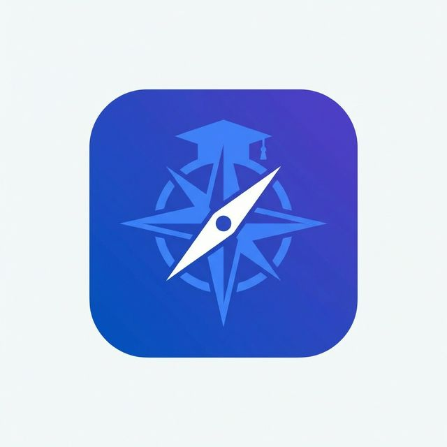
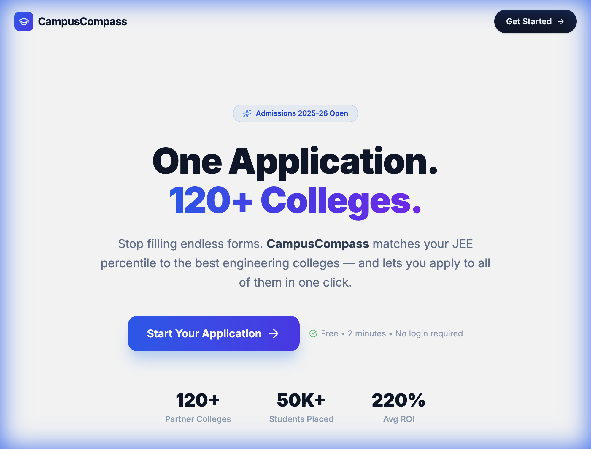
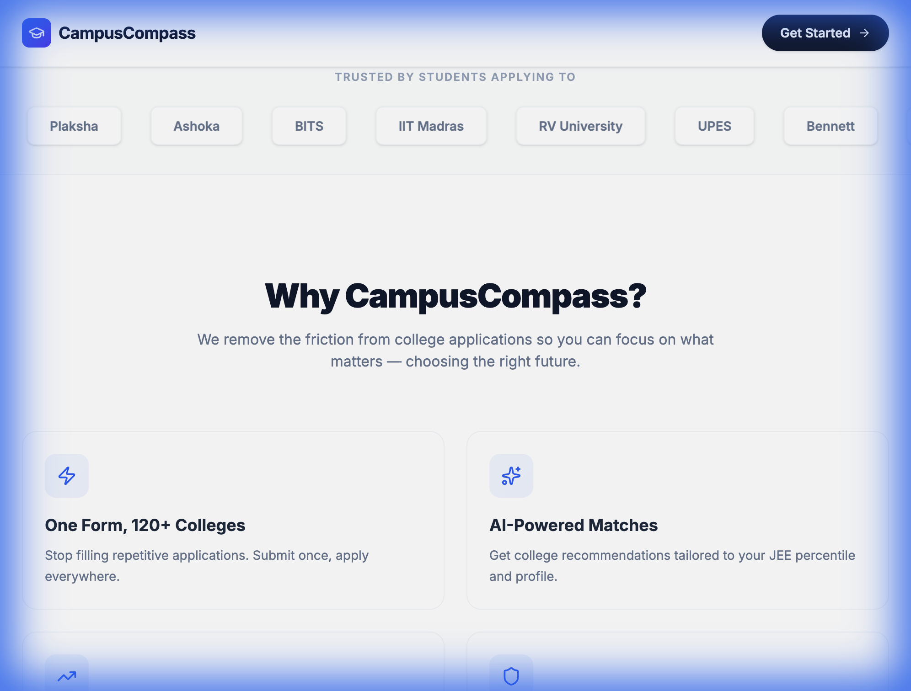
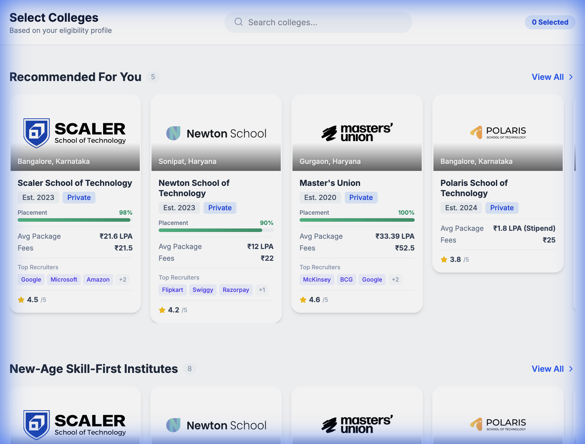
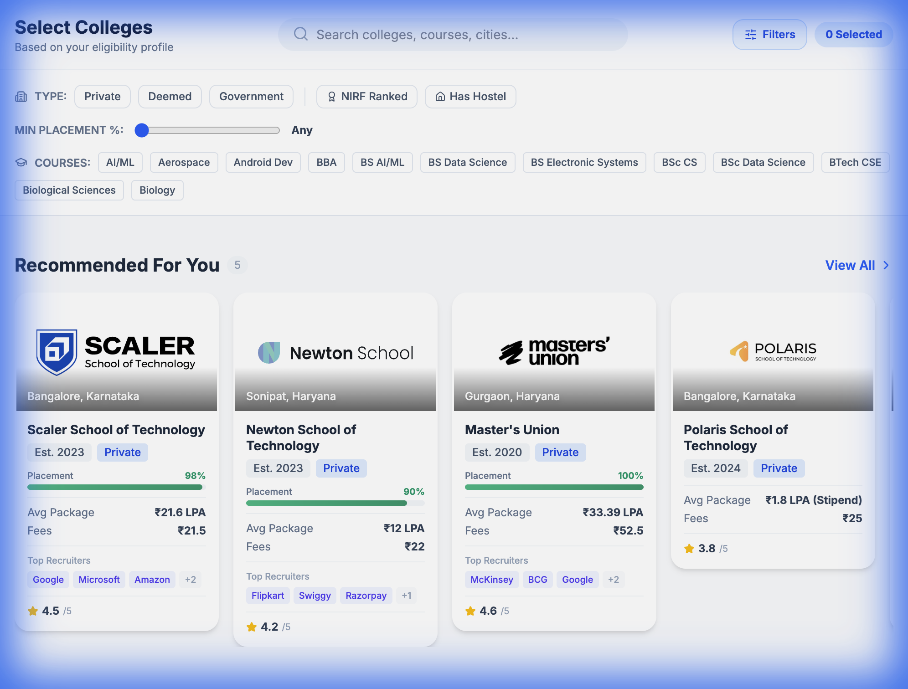
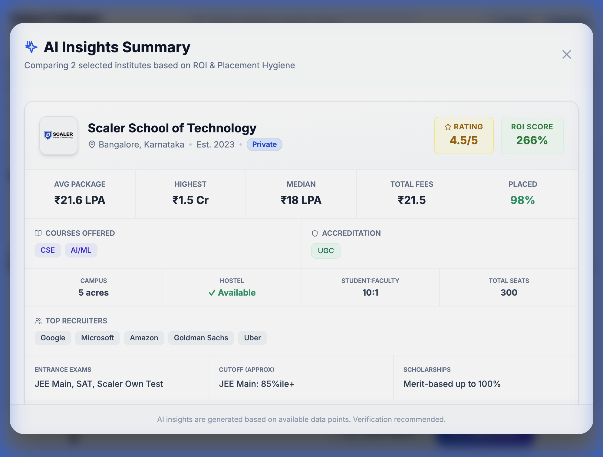

<p align="center">
  
</p>

<h1 align="center">🧭 CampusCompass</h1>

<p align="center">
  <strong>Guiding You to the Right Campus</strong>
</p>

<p align="center">
  <em>An AI-powered, data-rich college comparison platform built for engineering aspirants in India.</em>
</p>

<p align="center">
  <a href="#-features"></a>
  <a href="#-tech-stack"></a>
  <a href="#-tech-stack"></a>
  <a href="#-tech-stack"></a>
  <a href="#-license"></a>
</p>

<br/>

<p align="center">
  
</p>

---

## 📋 Table of Contents

- [About](#-about)
- [Features](#-features)
- [Screenshots](#-screenshots)
- [Tech Stack](#-tech-stack)
- [Getting Started](#-getting-started)
- [Project Structure](#-project-structure)
- [Data Model](#-data-model)
- [Documentation](#-documentation)
- [Contributing](#-contributing)
- [License](#-license)

---

## 🎯 About

**CampusCompass** is a modern web application that helps Indian engineering aspirants make informed college choices. With data on **25+ engineering institutes** across **30+ data points per college**, students can compare placements, packages, campus facilities, NIRF rankings, and more — all in one place.

Instead of visiting dozens of websites and forums, students fill a single application form and get:

- 🎓 **Personalized recommendations** based on JEE scores and preferences
- 📊 **Side-by-side comparisons** powered by AI insights
- 🔍 **Smart filters** to discover colleges by type, course, placement rate, and more
- 💰 **ROI analysis** calculating return on investment for each institute

> *"One Application. 120+ Colleges. Zero Confusion."*

---

## ✨ Features

### 🏠 Landing Experience
- Stunning glassmorphism hero section with animated gradients
- Feature cards highlighting the platform's key value propositions
- Smooth scroll animations powered by Framer Motion

### 📝 Smart Onboarding Form
- Multi-step form with real-time validation
- OTP-based contact verification
- Academic score inputs (JEE Mains, JEE Advanced, BITSAT, etc.)
- Responsive and mobile-friendly design

### 🏫 College Discovery
- **25+ colleges** across 5 curated categories:
  - 🚀 New-Age Skill-First Institutes
  - 🏆 Elite Universities
  - 💡 Affordable Universities
  - 🌐 Online Bachelor's Programs
  - ⭐ Recommended For You

### 🎴 Rich College Cards
Each card displays at a glance:
- College logo with fallback initials
- NIRF rank badge (amber)
- College type tag (Government / Private / Deemed)
- Placement percentage progress bar
- Average package & fee comparison
- Top recruiter chips (Google, Microsoft, Amazon, etc.)
- Star rating out of 5

### 🔍 Advanced Filters
- **College Type**: Government, Private, Deemed
- **NIRF Ranked**: Toggle to show only ranked colleges
- **Hostel Available**: Campus facility filter
- **Min Placement %**: Range slider (0–100%)
- **Courses**: Filter by B.Tech CSE, AI/ML, Data Science, and more
- **Search**: Matches college names, cities, *and* courses

### 🤖 AI Insights Modal
When you select colleges and click "Learn More", get a deep-dive comparison:
- 5-column placement stats (Avg / Highest / Median / Fees / Placed %)
- Courses offered as visual tags
- Accreditation badges (NAAC, NBA, UGC, etc.)
- Campus area, hostel availability, student-faculty ratio
- Full list of top recruiters
- Entrance exams, cutoffs, and scholarship info
- ROI score and star rating

### 🛒 Application Checkout
- Select multiple colleges and submit a single application
- Clean, professional checkout experience

---

## 📸 Screenshots

<details>
<summary><strong>Click to expand screenshots</strong></summary>

### Landing Page


### Features Section


### College Cards with Rich Data


### Advanced Filter Panel


### AI Summary Modal


</details>

---

## 🛠 Tech Stack

| Layer | Technology | Version |
|:---|:---|:---|
| **Framework** | React | 19.2 |
| **Build Tool** | Vite | 7.3 |
| **Styling** | Tailwind CSS | 4.1 |
| **Animations** | Framer Motion | 12.x |
| **Icons** | Lucide React | 0.564 |
| **Routing** | React Router DOM | 7.x |
| **Utilities** | clsx, tailwind-merge | Latest |
| **Linting** | ESLint | 9.x |

---

## 🚀 Getting Started

### Prerequisites

- **Node.js** ≥ 18.0
- **npm** ≥ 9.0

### Installation

```bash
# Clone the repository
git clone https://github.com/naviksha/master-engineering-app.git
cd master-engineering-app

# Install dependencies
npm install

# Start development server
npm run dev
```

The app will be available at `http://localhost:5173`.

### Build for Production

```bash
npm run build
npm run preview
```

---

## 📁 Project Structure

```
master-engineering-app/
├── public/
│   └── favicon.svg                 # Custom compass + grad cap icon
├── src/
│   ├── components/
│   │   ├── Landing/                # Hero & feature sections
│   │   │   └── LandingPage.jsx
│   │   ├── Form/                   # Multi-step onboarding form
│   │   │   └── FormPage.jsx
│   │   ├── Discovery/              # College browsing experience
│   │   │   ├── DiscoveryPage.jsx   # Main page with filters
│   │   │   ├── CollegeCard.jsx     # Rich data cards
│   │   │   └── HorizontalList.jsx  # Horizontal scroll lists
│   │   ├── Modals/
│   │   │   ├── AISummaryModal.jsx  # AI comparison modal
│   │   │   └── CheckoutModal.jsx   # Application checkout
│   │   └── Shared/                 # Reusable UI components
│   ├── data/
│   │   └── colleges.js             # 25 colleges × 30+ fields
│   ├── App.jsx                     # Root component & routing
│   ├── main.jsx                    # Entry point
│   └── index.css                   # Global styles
├── doc/                            # Project documentation
│   ├── PRD.md                      # Product Requirements Document
│   ├── UserStories.md              # User Stories
│   ├── UIUX_Design.md             # UI/UX Design Specification
│   ├── WBS.md                      # Work Breakdown Structure
│   ├── TestPlan.md                 # Test Plan
│   ├── RTM.md                      # Requirements Traceability Matrix
│   └── TaskTracker.md              # Task Tracker
├── index.html                      # Entry HTML with SEO meta tags
├── vite.config.js
├── tailwind.config.js
└── package.json
```

---

## 📊 Data Model

Each college in the dataset contains **30+ data points**:

| Category | Fields |
|:---|:---|
| **Identity** | `name`, `id`, `category`, `collegeType`, `autonomy` |
| **Location** | `city`, `state`, `coordinates` (lat/lng) |
| **Academics** | `courses`, `accreditation`, `entranceExams`, `cutoff` |
| **Placements** | `avgPackage`, `highestPackage`, `medianPackage`, `placementPercent`, `topRecruiters` |
| **Rankings** | `nirfRank`, `rating`, `roi` |
| **Campus** | `campusArea`, `hostelAvailable`, `totalSeats`, `studentFacultyRatio`, `genderRatio` |
| **Financial** | `fees`, `scholarships`, `batch` |
| **Other** | `year` (est.), `alumni`, `alumniCount`, `achievements`, `logo`, `website` |

Data sourced from NIRF rankings, Collegedunia, Shiksha, Careers360, and official college websites.

---

## 📚 Documentation

Comprehensive project documentation is available in the [`doc/`](doc/) directory:

| Document | Description |
|:---|:---|
| [PRD.md](doc/PRD.md) | Product Requirements Document |
| [UserStories.md](doc/UserStories.md) | User Stories & Acceptance Criteria |
| [UIUX_Design.md](doc/UIUX_Design.md) | UI/UX Design Specification |
| [WBS.md](doc/WBS.md) | Work Breakdown Structure |
| [TestPlan.md](doc/TestPlan.md) | Comprehensive Test Plan |
| [RTM.md](doc/RTM.md) | Requirements Traceability Matrix |

---

## 🤝 Contributing

Contributions are welcome! Here's how you can help:

1. **Fork** the repository
2. **Create** a feature branch (`git checkout -b feature/amazing-feature`)
3. **Commit** your changes (`git commit -m 'Add amazing feature'`)
4. **Push** to the branch (`git push origin feature/amazing-feature`)
5. **Open** a Pull Request

### Development Guidelines

- Follow clean-code principles — readability over cleverness
- Use functional components with hooks
- Keep components modular and reusable
- Run `npm run lint` before committing
- Test on both desktop and mobile viewports

---

## 📄 License

This project is licensed under the **MIT License**. See the [LICENSE](LICENSE) file for details.

---

<p align="center">
  <strong>Built with ❤️ by <a href="https://github.com/naviksha">Naviksha</a></strong>
</p>

<p align="center">
  <sub>If you found this helpful, give it a ⭐ — it helps others discover CampusCompass!</sub>
</p>
