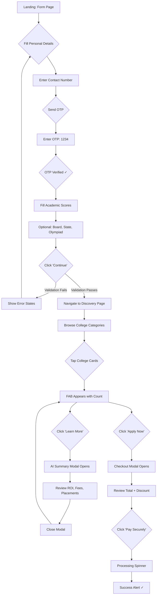

# UI/UX Design Document — CampusCompass

> **Version**: 1.0  
> **Last Updated**: 2026-02-16  
> **Author**: Development Team  
> **Status**: Active

---

## 1. Design Philosophy

**CampusCompass** follows a design philosophy rooted in **trust, clarity, and speed**. Engineering aspirants (17–19 years old) and their parents are the primary users — both are time-constrained and decision-fatigued during admission season.

| Principle | Rationale |
|---|---|
| **Mobile-First** | 85%+ Indian students browse on mobile. Every layout starts at 375px. |
| **Progressive Disclosure** | Show only what's needed. Optional fields are tucked inside accordions. |
| **Instant Feedback** | Real-time validation, micro-animations on selection, skeleton loaders. |
| **Visual Hierarchy** | Bold headings, clear sections, generous whitespace. No cognitive overload. |
| **Trust Signals** | OTP verification, "256-bit SSL" badge, clean professional aesthetics. |

---

## 2. Design System

### 2.1 Color Palette

| Token | Hex | Usage |
|---|---|---|
| `--primary` | `#2563EB` (Blue-600) | CTAs, links, selected states |
| `--primary-dark` | `#4338CA` (Indigo-700) | Gradient endpoints, hover states |
| `--success` | `#16A34A` (Green-600) | OTP verified, positive ROI badges |
| `--danger` | `#DC2626` (Red-600) | Validation errors |
| `--surface` | `#F8FAFC` (Slate-50) | Page backgrounds |
| `--surface-card` | `#FFFFFF` | Card backgrounds |
| `--text-primary` | `#0F172A` (Slate-900) | Headings, body text |
| `--text-secondary` | `#64748B` (Slate-500) | Captions, labels |
| `--border` | `#E2E8F0` (Slate-200) | Card borders, dividers |

### 2.2 Typography

| Element | Font | Size | Weight |
|---|---|---|---|
| Page Title (H1) | Inter | 30px / 1.875rem | 700 (Bold) |
| Section Header (H2) | Inter | 20px / 1.25rem | 700 |
| Card Title | Inter | 14px / 0.875rem | 700 |
| Body Text | Inter | 14px / 0.875rem | 400 |
| Caption / Label | Inter | 12px / 0.75rem | 500 (Medium) |
| Button Text | Inter | 14px–16px | 600–700 |

### 2.3 Spacing & Layout

| Token | Value | Usage |
|---|---|---|
| `--space-xs` | 4px | Inline gaps, icon padding |
| `--space-sm` | 8px | Between related elements |
| `--space-md` | 16px | Section padding, card gaps |
| `--space-lg` | 24px | Between major sections |
| `--space-xl` | 32px | Page padding |
| `--radius-sm` | 8px | Buttons, badges |
| `--radius-md` | 12px | Input fields |
| `--radius-lg` | 16px | Cards |
| `--radius-xl` | 24px | Modals, main container |

### 2.4 Elevation & Shadows

| Level | CSS | Usage |
|---|---|---|
| Level 0 | None | Flat elements |
| Level 1 | `0 1px 3px rgba(0,0,0,0.1)` | Cards at rest |
| Level 2 | `0 4px 15px rgba(0,0,0,0.1)` | Cards on hover |
| Level 3 | `0 10px 40px rgba(37,99,235,0.15)` | Selected cards, FAB |
| Level 4 | `0 25px 50px rgba(0,0,0,0.15)` | Modals |

### 2.5 Iconography
- **Library**: Lucide React (consistent 24px stroke icons)
- **Style**: Outlined, 2px stroke, rounded caps
- **Usage**: Always paired with text labels on buttons; standalone only in compact card layouts

---

## 3. Screen-by-Screen Specifications

### 3.1 Page 1 — Master Application Form

#### Layout Structure
```
┌──────────────────────────────────────────┐
│  ┌─ HEADER BANNER (Gradient) ──────────┐ │
│  │  Badge: "Single Application Form"   │ │
│  │  H1: "CampusCompass"                │ │
│  │  Tagline: "Guiding you to..."       │ │
│  └─────────────────────────────────────┘ │
│                                          │
│  ┌─ SECTION 1: Personal Details ───────┐ │
│  │  [Student Name]    [Parent Name]    │ │
│  │  [Contact Number] [Verify OTP btn]  │ │
│  └─────────────────────────────────────┘ │
│                                          │
│  ┌─ SECTION 2: Academic Scores ────────┐ │
│  │  [JEE Percentile ✦]  [BITSAT]      │ │
│  │  [COMEDK Rank]        [VITEEE]      │ │
│  │  ☑ Not Appeared (toggles JEE off)   │ │
│  └─────────────────────────────────────┘ │
│                                          │
│  ┌─ SECTION 3: Optional (Accordion) ──┐ │
│  │  ▶ Additional Details (Optional)    │ │
│  │    [Board ▾]   [Home State ▾]       │ │
│  │    [PCM %]     [Olympiad text]      │ │
│  └─────────────────────────────────────┘ │
│                                          │
│  ╔═══════════════════════════════════╗   │
│  ║  Continue to College Selection →  ║   │
│  ╚═══════════════════════════════════╝   │
│  🔒 Your data is 100% secure            │
└──────────────────────────────────────────┘
```

#### Component Specifications

| Component | PRD Ref | Type | States | Behavior |
|---|---|---|---|---|
| Student Name | FR-4.1 | Text Input | Empty, Focused, Filled, Error | Required. Error: "Student Name is required" |
| Parent Name | FR-4.1 | Text Input | Empty, Focused, Filled, Error | Required. Error: "Parent Name is required" |
| Contact Number | FR-4.1 | Tel Input | Empty, Focused, Filled, Error, Verified | 10-digit validation. Disables after OTP verified. |
| OTP Button | FR-4.1 | Button → OTP Input | Idle → "Verify OTP" → "Enter OTP" + "Verify" → "✓ Verified" | 3-state transition. Mock OTP = `1234`. |
| JEE Percentile | FR-4.1 | Number Input | Empty, Focused, Filled, Disabled (if "Not Appeared") | Range: 0.00–100.00. Primary sorting metric. |
| "Not Appeared" | FR-4.1 | Checkbox | Unchecked, Checked | Disables + clears JEE input when checked. |
| BITSAT / COMEDK / VITEEE | FR-4.1 | Number Inputs | Empty, Focused, Filled | Optional. No validation enforced. |
| Board Dropdown | FR-4.1 | Select | Default ("Select Board"), Selected | Options: CBSE, ICSE, State Board, IB |
| Home State Dropdown | FR-4.1 | Select | Default, Selected | Major Indian states |
| PCM Aggregate % | FR-4.1 | Number Input | Empty, Filled | Optional. Range: 0–100. |
| Olympiad | FR-4.1 | Text Input | Empty, Filled | Free text (e.g., "RMO qualified") |
| "Continue" CTA | FR-4.1 | Button | Idle, Hover, Active, Disabled | Full-width gradient. Validates all required fields + OTP before navigating. |

#### Interaction & Animation Details
- **Input Focus**: Border transitions from `slate-200` → `blue-500` with `0.2s ease`. Focus ring: `shadow-md shadow-blue-100`.
- **Error State**: Border turns `red-300`, background tints `red-50`, error icon appears (AlertCircle) with 0.2s fade-in.
- **OTP Flow**: "Verify OTP" button → slides in OTP input + "Verify" button using `slide-in-from-right` animation (0.3s).
- **Accordion**: `<details>` with chevron rotation (0° → 90°) on open. Content area slides down.
- **Submit Button**: `active:scale-[0.99]` press effect. Arrow icon translates 4px right on hover.

---

### 3.2 Page 2 — College Discovery & Selection

#### Layout Structure
```
┌───────────────────────────────────────────────┐
│ ┌─ STICKY HEADER ───────────────────────────┐ │
│ │ "Select Colleges"   [🔍 Search]  [3 Sel.] │ │
│ └───────────────────────────────────────────┘ │
│                                               │
│  ── Recommended For You (5) ──────────────    │
│  ┌────┐ ┌────┐ ┌────┐ ┌────┐ ┌────┐  →→→    │
│  │Card│ │Card│ │Card│ │Card│ │Card│          │
│  └────┘ └────┘ └────┘ └────┘ └────┘          │
│                                               │
│  ── New-Age Skill-First (8) ─── [View All]    │
│  ┌────┐ ┌────┐ ┌────┐ ┌────┐ ┌────┐  →→→    │
│  │Card│ │Card│ │✓Sel│ │Card│ │Card│          │
│  └────┘ └────┘ └────┘ └────┘ └────┘          │
│                                               │
│  ── Elite Universities (5) ─── [View All]     │
│  ...                                          │
│                                               │
│  ── Affordable Universities (12) ─ [View All] │
│  ...                                          │
│                                               │
│  ── Online Bachelor's (4) ──────────────      │
│  ...                                          │
│                                               │
│ ┌═══════════════════════════════════════════┐ │
│ │ 3 Selected  │ [Learn More] [Apply Now →]  │ │
│ └═══════════════════════════════════════════┘ │
└───────────────────────────────────────────────┘
```

#### College Card Specification

| Property | Value |
|---|---|
| Dimensions | 224px × 288px (w-56 h-72) |
| Border Radius | 16px (rounded-2xl) |
| Image Area | Top 128px — college logo/photo with gradient overlay |
| Content Area | Bottom — Name, Est. Year badge, Avg Package, Fees |
| Unselected State | White bg, `shadow-md`, transparent border |
| Hover State | `shadow-xl`, translate Y -4px (lifts up) |
| Selected State | `blue-50` bg, `blue-500` border, `scale-105`, checkmark badge (top-right, green circle with white check) |
| Selection Animation | Checkmark: `zoom-in` 0.2s. Card: scale transition 0.3s. |

#### Horizontal Scroll Container
- **Scroll behavior**: CSS `overflow-x: auto` with `snap-x` for mobile.
- **Scrollbar**: Hidden via `scrollbar-hide` utility.
- **"View All" Toggle**: When clicked, container switches from `overflow-x: auto` → `flex-wrap` (grid layout).
- **Chevron indicator**: Rotates 90° on expand.

#### Floating Action Bar (FAB)
- **Trigger**: Appears when `selectedColleges.length > 0`.
- **Entry Animation**: `slide-in-from-bottom` 0.3s.
- **Position**: `fixed bottom-0`, full-width, `z-50`.
- **Shadow**: `shadow-2xl` to separate from page content.
- **Content**: Left — "X Selected" count. Right — "Learn More" (secondary) + "Apply Now" (primary gradient).

#### Search Bar
- **Position**: Centered in sticky header.
- **Style**: `bg-slate-100 rounded-full` with search icon prefix.
- **Behavior**: Filters all college lists in real-time by `name` or `city`.

---

### 3.3 AI Summary Modal

#### Layout Structure
```
┌─────────────────────────────────────────┐
│ ┌─ MODAL HEADER ──────────────────────┐ │
│ │ ✦ AI Insights Summary         [✕]  │ │
│ │ "Comparing 3 selected institutes"   │ │
│ └─────────────────────────────────────┘ │
│                                         │
│ ┌─ COLLEGE CARD 1 ────────────────────┐ │
│ │ ┌───────────────────────────────┐   │ │
│ │ │ [Logo] Name        ROI: 266% │   │ │
│ │ │        City, State • Est.    │   │ │
│ │ └───────────────────────────────┘   │ │
│ │ ┌──────┬──────┬──────┬──────┐      │ │
│ │ │ Avg  │ High │ Fees │Alumni│      │ │
│ │ │₹21LP │₹1.5C│₹21.5L│ N/A  │      │ │
│ │ └──────┴──────┴──────┴──────┘      │ │
│ │ ✦ Key Highlights              │   │ │
│ │ "Industry-integrated..."       │   │ │
│ │              [Visit Website →] │   │ │
│ └─────────────────────────────────────┘ │
│                                         │
│ ┌─ COLLEGE CARD 2 ────────────────────┐ │
│ │ ...                                 │ │
│ └─────────────────────────────────────┘ │
│                                         │
│ ┌─ FOOTER ────────────────────────────┐ │
│ │ "AI insights are generated..."      │ │
│ └─────────────────────────────────────┘ │
└─────────────────────────────────────────┘
```

#### Key Interactions
- **Open**: Triggered from FAB "Learn More". Entry: `fade-in` + `zoom-in-95` 0.3s.
- **Close**: "✕" button or clicking backdrop (`bg-black/60 backdrop-blur-sm`).
- **Scroll**: Inner content scrolls independently (`max-h-[90vh] overflow-y-auto`).
- **"Visit Website"**: Opens college URL in a new tab (`target="_blank"`).
- **Stats Grid**: 4-column on desktop, 2-column on mobile. Divided by subtle borders.

---

### 3.4 Checkout Modal

#### Layout Structure
```
┌─────────────────────────────┐
│ Review Application    [✕]   │
│ "Applying to 3 colleges"    │
│─────────────────────────────│
│ ① Scaler School        ₹500│
│ ② Newton School         ₹500│
│ ③ Plaksha University    ₹500│
│─────────────────────────────│
│ Subtotal             ₹1,500 │
│ Bundle Discount       -₹200 │
│ ━━━━━━━━━━━━━━━━━━━━━━━━━━ │
│ Total Payable        ₹1,300 │
│─────────────────────────────│
│ ╔═══════════════════════╗   │
│ ║ 💳 Pay ₹1,300 Securely║   │
│ ╚═══════════════════════╝   │
│ 🔒 256-bit SSL Encrypted   │
└─────────────────────────────┘
```

#### Pricing Logic
- **Base fee**: ₹500 per college application.
- **Bundle Discount**: ₹200 off if > 3 colleges selected.
- **Payment Button States**: Idle → Processing (spinner) → Success (alert).

---

## 4. Responsive Breakpoints

| Breakpoint | Width | Layout Changes |
|---|---|---|
| **Mobile** | < 640px | Single column form. Cards scroll horizontally. FAB stacks vertically. |
| **Tablet** | 640px–1024px | 2-column form grid. Cards still scroll horizontally. |
| **Desktop** | > 1024px | 2-column form. Full horizontal lists. Stats grid 4-col. |

---

## 5. Accessibility Considerations

| Area | Implementation |
|---|---|
| **Color Contrast** | All text meets WCAG AA (4.5:1 ratio minimum) |
| **Focus Indicators** | Visible focus rings on all interactive elements via `:focus-visible` |
| **Semantic HTML** | `<header>`, `<main>`, `<section>`, `<details>`, `<label>` used appropriately |
| **Keyboard Navigation** | All buttons, inputs, and cards are keyboard-accessible (Tab + Enter) |
| **Screen Reader** | Labels on all inputs. Alt text on college logos. ARIA labels on icon-only buttons |
| **Motion** | Animations respect `prefers-reduced-motion` where possible |

---

## 6. User Flow Diagram



---

## 7. PRD Coverage Matrix

This table confirms that **every** PRD requirement is addressed in this UI/UX specification.

| PRD Section | Requirement | UI/UX Section | Status |
|---|---|---|---|
| 4.1 | Student Name input | §3.1 Component Spec | ✅ |
| 4.1 | Parent Name input | §3.1 Component Spec | ✅ |
| 4.1 | Contact + OTP Verification | §3.1 Component Spec + Interaction | ✅ |
| 4.1 | JEE Mains Percentile | §3.1 Component Spec | ✅ |
| 4.1 | Other Exams (BITSAT, COMEDK, etc.) | §3.1 Component Spec | ✅ |
| 4.1 | Board Dropdown | §3.1 Component Spec | ✅ |
| 4.1 | Home State (Optional) | §3.1 Accordion Section | ✅ |
| 4.1 | PCM+CS Marks (Optional) | §3.1 Accordion Section | ✅ |
| 4.1 | Olympiad Scores (Optional) | §3.1 Accordion Section | ✅ |
| 4.1 | Real-time validation | §3.1 Interaction & Animation | ✅ |
| 4.2 | Netflix-style horizontal scrolling | §3.2 Horizontal Scroll Container | ✅ |
| 4.2 | 5 Category Segments | §3.2 Layout Structure | ✅ |
| 4.2 | College Card (Name, Logo, Select) | §3.2 College Card Spec | ✅ |
| 4.2 | "Expand" button for grid view | §3.2 "View All" Toggle | ✅ |
| 4.2 | FAB with Apply + Learn More | §3.2 FAB Spec | ✅ |
| 4.3 | AI Summary Modal | §3.3 Full Spec | ✅ |
| 4.3 | Logo, Name, Location header | §3.3 Layout | ✅ |
| 4.3 | Year Est., Batch Size stats | §3.3 Stats Grid | ✅ |
| 4.3 | Alumni, Placements, ROI | §3.3 Stats Grid | ✅ |
| 4.3 | Fees structure | §3.3 Stats Grid | ✅ |
| 4.3 | "Visit Website" button | §3.3 Key Interactions | ✅ |
| 4.4 | Selected colleges list + fees | §3.4 Layout | ✅ |
| 4.4 | Total calculation | §3.4 Pricing Logic | ✅ |
| 4.4 | Payment gateway integration | §3.4 Payment Button | ✅ |
| 5 | Page load < 2s | §4 Responsive Breakpoints | ✅ |
| 5 | Mobile-first responsive | §4 Responsive Breakpoints | ✅ |
| 5 | Data encryption / SSL | §3.4 Trust Badge | ✅ |
